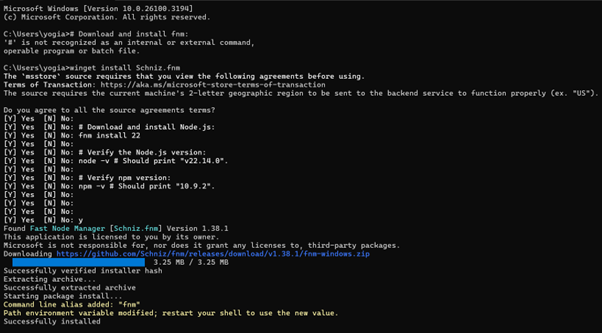

## Laporan Praktikum

|  | Pemrograman Berbasis Framework 2025 |
|--|--|
| NIM |  2241720261|
| Nama |  Yogianna Nur Febrianti |
| Kelas | TI - 3A |

### Pertanyaan Praktikum 1 

1. Jelaskan kegunaan masing-masing dari Git, VS Code dan NodeJS yang telah Anda install pada sesi praktikum ini! 

Jawab : 

•	Git: Digunakan sebagai sistem kontrol versi untuk melacak perubahan kode dan berkolaborasi dengan tim dalam pengembangan perangkat lunak.

•	VS Code: Editor kode sumber yang ringan dan memiliki banyak ekstensi yang mendukung pengembangan aplikasi berbasis framework.

•	Node.js: Runtime JavaScript yang memungkinkan pengembang menjalankan JavaScript di luar browser, serta dilengkapi dengan NPM (Node Package Manager) untuk mengelola dependensi.

2. Untuk memastikan bahwa Git, VS Code, dan Node.js telah berhasil diinstal di perangkat Anda, silakan lampirkan screenshot hasil verifikasi sebagai berikut:

Jawab : 

- Hasil perintah `git --version` yang menunjukkan versi Git yang terinstal.

- Tampilan antarmuka Visual Studio Code setelah dibuka.

- Hasil perintah `node -v` dan `npm -v` yang menunjukkan versi Node.js dan NPM yang terinstal.

### Pertanyaan Praktikum 2

1. Pada Langkah ke-2, setelah membuat proyek baru menggunakan Next.js, terdapat beberapa istilah yang muncul. Jelaskan istilah tersebut, TypeScript, ESLint, Tailwind CSS, App Router, Import alias, App router, dan Turbopack!

Jawab : 

- TypeScript: Bahasa pemrograman berbasis JavaScript yang memiliki fitur static typing untuk meningkatkan keandalan kode.

- ESLint: Alat yang membantu menjaga kualitas kode JavaScript dengan mendeteksi kesalahan sintaks dan gaya pemrograman.

- Tailwind CSS: Framework CSS yang memungkinkan styling berbasis utility classes tanpa perlu menulis banyak kode CSS secara manual.

- App Router: Sistem navigasi di Next.js yang mengatur bagaimana halaman dirender dan berpindah di dalam aplikasi.

- Import Alias: Fitur di Next.js yang memungkinkan pemanggilan modul dengan jalur yang lebih pendek dan mudah dibaca.

- Turbopack: Pengganti Webpack yang lebih cepat dan dioptimalkan untuk performa tinggi dalam proses bundling kode.

2. Apa saja kegunaan folder dan file yang ada pada struktur proyek React yang tampil pada gambar pada tahap percobaan ke-3!

Jawab : 

- pages → Folder utama untuk halaman-halaman aplikasi.

- /public → Menyimpan aset statis seperti gambar dan ikon.

- /components → Berisi komponen-komponen React yang dapat digunakan kembali.

- package.json → File konfigurasi proyek yang mencantumkan dependensi dan script.

- .eslintrc.json → File konfigurasi ESLint untuk memastikan kode tetap konsisten.

- next.config.js → File konfigurasi Next.js untuk pengaturan proyek.

3. Tahapan instalasi dan konfigurasi proyek telah berhasil dilakukan, silakan lampirkan screenshot yang menunjukkan:

- Hasil eksekusi perintah `npx create-next-app@latest` yang berhasil.
Jawab : 

### Pertanyaan Praktikum 3

1. Screenshot yang menunjukkan bahwa komponen **MyButton** telah berhasil ditambahkan dan muncul pada halaman website. Screenshot harus memperlihatkan tampilan tombol tambahan yang telah dibuat di dalam antarmuka aplikasi React.

Jawab : 

### Pertanyaan Praktikum 4
1. Untuk apakah kegunaan sintaks user.imageUrl?

Jawab : `user.imageUrl` digunakan untuk mengambil URL gambar dari objek `user` dan menampilkannya sebagai sumber gambar dalam elemen `` di React.

2. Kode JSX telah berhasil dijalankan, lampirkan screenshot yang menunjukkan tampilan halaman dengan komponen **MyProfile** yang sudah berisi gambar dan teks dari objek `user`.

Jawab : 

## **Kesimpulan**

Praktikum ini memperkenalkan dasar-dasar **pemrograman berbasis framework** dengan ReactJS dan Next.js. Dengan memahami konsep-konsep ini, kita dapat mengembangkan aplikasi modern yang modular, efisien, dan mudah dikembangkan lebih lanjut.

**Repository GitHub:** *https://github.com/yogiannanf/2241720261-YogiannaNurFebrianti-Pem.BerbasisFramework2025*